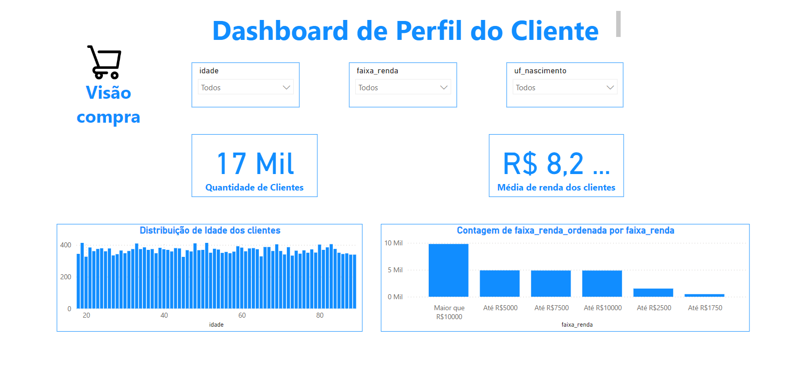

# Desafio de Previsão de Vendas em E-commerce com Power BI

## Descrição Geral

Este projeto faz parte do curso de Ciência de Dados da Escola DNC, onde o objetivo foi desenvolver um dashboard em Power BI para prever o faturamento de um e-commerce. Utilizamos dados reais de vendas e clientes, aplicando técnicas de análise de dados para fornecer insights e recomendações baseadas nos resultados obtidos.

O desafio original proposto pela DNC foi desenvolvido em duas versões. A primeira versão segue exatamente o modelo proposto, mas a segunda vai além, integrando habilidades profissionais de design e storytelling.

## Objetivos

- Prever os resultados de faturamento de um e-commerce utilizando Power BI.
- Analisar o perfil dos clientes e o desempenho das vendas.
- Propor melhorias e estratégias baseadas nos dados.

## Bases de Dados Utilizadas

- **Base Compra**: Inclui informações sobre as vendas, como `idcompra`, `idcanalvenda`, `preço`, e `nome do departamento`.
- **Base Cliente**: Contém dados sobre os clientes, como `idade`, `renda`, e `estado de nascimento`.

## Tratamento de Dados

1. **Limpeza**:
   - Remoção de duplicatas e outliers.
   - Correção de inconsistências nos dados de idade, renda e nome de departamento.

2. **Transformações**:
   - Criação de colunas calculadas para faixas etárias e total de vendas.
   - Padronização dos estados e datas (mês e ano).

3. **Criação de Métricas**:
   - **Quantidade de vendas**: Contagem total das vendas.
   - **Valor total das vendas**: Cálculo do valor total com e sem frete.
   - **Média de renda** dos clientes.

## Análises Realizadas

### Visão Cliente

- Gráficos mostrando a **distribuição de idade** e **renda** dos clientes.
- Cartões com a **quantidade total de clientes** e a **média de renda**.

### Visão Vendas

- Gráficos de linhas mostrando a **evolução das vendas ao longo do tempo**.
- Gráficos de barras comparando **vendas por categoria** de produto.
- Cartões mostrando a **quantidade total de vendas** e o **valor total com frete**.

### Filtros Interativos

- Adição de filtros para **estado**, **faixa de renda** e **departamento** para permitir segmentações mais detalhadas e refinadas.

## Primeira Versão - Modelo Proposto pela DNC

A primeira versão do dashboard foi criada seguindo exatamente o que foi proposto pela DNC. Ela inclui as métricas e gráficos essenciais, mas com um design mais simples e funcional, sem muitas personalizações.

**Imagens da Primeira Versão**:
- Acesse o Dashboard 1º Versão: <strong><a href="https://app.powerbi.com/view?r=eyJrIjoiM2FiMzM4OTctNmIxNi00MGUyLWJhM2QtNzcyOGNlYmU5MDYxIiwidCI6IjI2ZGY0NTFkLWUwMGQtNGJjMC04OGY5LTExMGFkZDVlZDc5OSJ9&pageName=43ce07e459c179a20992">Clique aqui!</strong></a>

### Características da Versão 1

- Gráficos básicos de barras e linhas.
- Filtros interativos simples para categorias e canais de venda.
- Layout funcional, focado em entregar o resultado proposto no desafio.

## Segunda Versão - Melhorias e Profissionalização

Na segunda versão, fui além do proposto pela DNC. Não me limitei apenas ao modelo básico, mas busquei entregar um dashboard que estivesse mais próximo de uma aplicação profissional. Para isso, criei **templates no PowerPoint** e apliquei um design mais sofisticado ao dashboard, utilizando **elementos visuais personalizados**.

**Imagens da Segunda Versão**:

- Acesse o Dashboard 2º Versão: <strong><a href="https://app.powerbi.com/view?r=eyJrIjoiODc0MTU4YWQtYWUwZS00MDVmLWI3OTctOGFjYWJkMGJhZDk5IiwidCI6IjI2ZGY0NTFkLWUwMGQtNGJjMC04OGY5LTExMGFkZDVlZDc5OSJ9&pageName=723cced0010020015803">Clique aqui!</strong></a>

### Características da Versão 2

- **Template visual criado no PowerPoint**, com fundo escuro, contrastes mais fortes e ícones personalizados.
- **Gráficos dinâmicos e interativos** com visualizações mais profundas, comparando categorias de produtos e regiões.
- Adição de novos **filtros interativos**, como faixa de renda e estado de nascimento, permitindo uma segmentação mais rica dos dados.
- Cartões personalizados com ícones que facilitam a visualização de KPIs (Key Performance Indicators).

A segunda versão representou uma **entrega além do esperado**, incorporando uma estética mais profissional e uma narrativa mais clara nos dados, fornecendo uma experiência visual mais rica e interativa para o usuário.

## Estrutura do Projeto

## Conclusão

As análises realizadas neste desafio ajudaram a entender melhor o comportamento dos clientes e o desempenho de vendas do e-commerce. O uso de técnicas de análise de dados e a aplicação de DAX no Power BI permitiram a criação de um dashboard robusto, que oferece insights valiosos para a tomada de decisões estratégicas.

Na **primeira versão**, o objetivo foi cumprir o desafio proposto de maneira funcional, com as métricas e gráficos solicitados.

Na **segunda versão**, busquei ir além do básico, criando um dashboard que é não só funcional, mas visualmente atrativo e interativo, refletindo um cenário mais real e profissional.

## Licença

Este projeto está licenciado sob a [MIT License](LICENSE).
